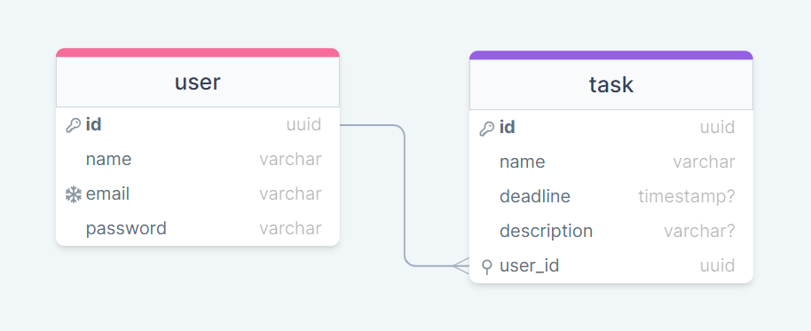

# Sobre o Projeto

Consiste em um **gerenciador de tarefas com autenticação**, em que cada usuário pode ler, criar, editar e excluir uma atividade. Além disso, é possível estabelecer prazos para a conclusão das tarefas e visualizar aquelas que estão em atraso. O principal objetivo de seu desenvolvimento foi o estudo.

## Modelagem do Banco de Dados


### Dicionário de dados

*User*

```
id: código de identificação de cada registro do usuário.

name: nome completo do usuário.

email: endereço de email único associado a um indivíduo. Campo único

password: senha associada a um usuário para fins de autenticação. Mínimo de 6 caracteres.
```

*Task*

```
id: código de identificação de cada registro de uma tarefa.

name: nome da tarefa.

deadline: prazo para realização de uma tarefa. Campo opcional.

description: para fornecer uma explicação ou informação adicional sovbre uma tarefa. Campo opcional.

```

## Tecnologias e Ferramentas

> Mysql

> NodeJs + Express

> JWT (JSON Web Tokens)

Um JWT é um **padrão para autenticação e troca de informações**. Nele, é possível armazenar de forma segura e compacta objetos JSON. Este token é um código Base64 e pode ser assinado usando um segredo ou par de chaves privadas/públicas. Tokens assinados podem verificar a integridade das informações contidas neles, diferente de tokens criptografados que ocultam essas informações. *Estrutura*: Header, Payload, Signature.

> UUID (Universally Unique IDentifier)

É um identificador universalmente exclusivo utilizado para identificação de qualquer coisa no mundo da computação. O UUID é um número de 128 bits representado por 32 dígitos hexadecimais. 

Entre as **vantagens** e **motivos de sua escolha** no projeto: omissão da quantidade de registros criados em uma tabela e dificuldade na manipulação da URL. 

**Desvantagens**: maior uso de espaço e menor desempenho (em tabelas com muitos registros) quando armazenado como string.

> Bcrypt

Tem o propósito de esconder senhas criadas pelos usuários em forma de texto “puro” em dados criptografados, utilizando o algoritmo hash.  Essa é uma ferramenta segura para armazenar senhas no banco de dados e pode ser utilizada por qualquer linguagem

*Critérios importantes*: 
* O Bcrypt usa o "salt" para adicionar aleatoriedade às senhas, gerando hashes únicos mesmo para senhas idênticas. Isso aumenta a segurança contra ataques de força bruta. Salt é uma sequência de caracteres, números ou termos adicionados antes da senha
* Ajusta o custo computacional através do parâmetro "saltRounds". Quanto maior esse valor, mais lento será o processamento para calcular o hash da senha, aumentando a segurança. O valor padrão é 10, mas escolher um valor mais alto pode atrasar ataques de força bruta, embora deva ser equilibrado para garantir uma verificação de login eficiente.

> Joi

Biblioteca para validação de dados com base em esquemas.

> Cors


> Moment

## Regras de negócio

* O email não pode ser editado.

## Perspectivas Futuras ou Melhorias

* **Refatorar o tratamento de erros**: utilizar middlewares e orientação a objetos para personalizar os erros e gerar status mais condizentes.
